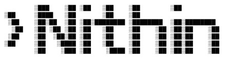

<h3>Hi, I'm</h3>
                                             
 
  <h3>
    
  </h3>

  

    <i>"I juggle hardware and software because choosing just one felt… too easy :p"</i>
  

---

### 👀 About Me

- 🌱 **Current Focus:** Leveling up in **Hardware Design Verification** and **Computer Architecture**.  
- 🤜🤛 **Collaboration:** Open to collaborating on **Verification, RTL, or hardware-related automation tools**.  
- 📫 **Get in touch:** Reach out at [**bvsnithin412@tamu.edu**](mailto:bvsnithin412@tamu.edu) or connect on [**LinkedIn**](https://www.linkedin.com/in/bvsnithin/).

---

### 🧱 Skills & Tools

#### 🧠 Hardware Design & Verification

  <!-- System / HDL -->
  
  
  
  
  
  

#### ⚙️ EDA Tools

  <!-- ⚙️ EDA Tools -->
  
  

#### 💻 Programming & Scripting

  <!-- 💻 Programming & Scripting -->
  
  
  
  

#### 🌐 Backend & Software Engineering

  <!-- 🌐 Backend & Software Engineering -->
  
  
  
  
  

#### 🎨 Frontend

  <!-- 🎨 Frontend -->
  
  
  
  

#### ☁️ Cloud, Integration & Databases

  <!-- ☁️ Cloud, Integration & Databases -->
  
  
  

#### 🛠️ Systems

  <!-- 🛠️ Systems -->
  

---

  
  
<i>Thanks for stopping by! Feel free to explore my repos 🚀</i>

